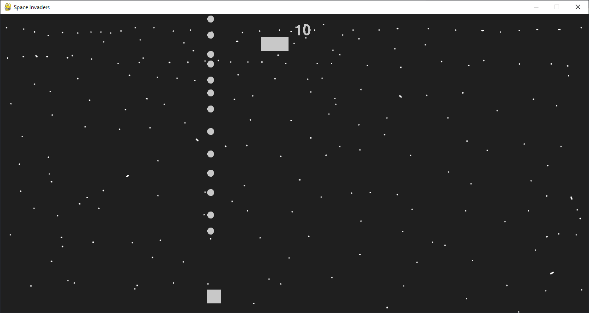

# Space Invaders
I tried making this game using pygame. it's still not "fully" finished but for now I just added an enemy ship that moves left to right and your ship can move left to right by the arrow buttons and can shoot bullets with the spacebar. You get 1 point for every bullet that hits the enemy. I'll make this better when I learn more about pygame.

# Download
To play the game either download the source code from the github release and run the `main.py` file or just download the `game.exe` file and run it.

